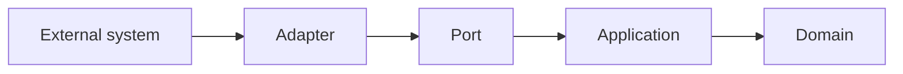
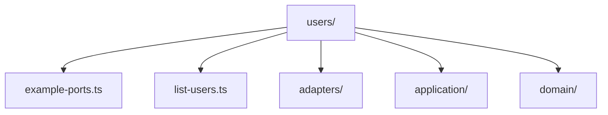

### Context Ports

Context ports define the communication available at a context boundary.
They describe which concrete capability a context exposes, what data enters
that capability, and what data it returns.

In practice a port is usually not just an abstraction or a contract. It is a
specific boundary element of the system with identity: a command handler, a
query entry point, an event consumer, a published endpoint, or another concrete
interaction mechanism that exists because the running system exposes it.

Types and interfaces still matter, but they are secondary. Their role is to
make the port explicit. The main concern is the port as a real executable
surface that another actor can call or observe.

> **Hint**
> The generated `example-ports.ts` file is only a placeholder. Replace it when
> the first real interaction of the context becomes clear.

#### Root Port File

The generated context starts with a single root file for ports.

```ts title="users/example-ports.ts"
export function example(): void {
    // ...
}
```

This placeholder does not define a real port yet. Its purpose is to mark the
context root as the place where boundary-facing capabilities are declared.

#### First Port

In the following example we replace the placeholder with a concrete port for
creating a user.

```ts title="users/example-ports.ts"
export type CreateUserRequest = {
    user: {
        id: string
        email: string
        active: boolean | null
    }
}

export type CreateUserResponse = {
    user: {
        id: string
        email: string
        active: boolean | null
    }
}

export interface CreateUserPort {
    create(request: CreateUserRequest): Promise<CreateUserResponse>
}
```

`CreateUserRequest` defines the incoming payload. `CreateUserResponse` defines
the outgoing payload. `CreateUserPort` names the concrete capability exposed at
the boundary: creating a user.

This definition does not commit to HTTP, queues, or databases. It focuses on
the interaction the context makes available. The transport can vary, but the
port remains the same identifiable boundary capability.

#### Adapter Implementation

Now that the port exists, the system can materialize it through an adapter and
delegate the work to an application service.

```ts title="users/adapters/create-user.ts"
import type {
    CreateUserPort,
    CreateUserRequest,
    CreateUserResponse,
} from '../example-ports.js'

type CreateUserService = {
    execute(data: {
        id: string
        email: string
        active: boolean | null
    }): Promise<CreateUserResponse>
}

export class CreateUserAdapter implements CreateUserPort {
    public constructor(
        private readonly service: CreateUserService,
    ) {}

    public async create(
        request: CreateUserRequest,
    ): Promise<CreateUserResponse> {
        return this.service.execute({
            id: request.user.id,
            email: request.user.email,
            active: request.user.active,
        })
    }
}
```

The adapter implements `CreateUserPort`, so it materializes the boundary
capability and provides `create()`. Inside that method it translates the
root-level request into the input expected by the application service.

This is the normal flow of the generated structure:



The port belongs to the boundary because it is part of what the context really
exposes. The adapter is one implementation path for that port. The application
process executes the use case and uses domain capabilities.

#### Multiple Port Files

As the context grows, you can keep several ports at the context root.

```ts title="users/list-users.ts"
export type ListUsersRequest = {
    active: boolean | null
}

export type ListUsersResponse = {
    users: Array<{
        id: string
        email: string
        active: boolean | null
    }>
}

export interface ListUsersPort {
    list(request: ListUsersRequest): Promise<ListUsersResponse>
}
```

An adapter can then import the port definition from the file that owns it.

This arrangement is useful when one context exposes several independent
capabilities. A single file works well for a small context. Separate files
become easier to maintain when each port has its own identity and
responsibility.

> **Warning**
> A port should define an exposed boundary capability, not domain internals.
> Avoid moving entity rules, repository logic, or infrastructure details into
> the port file.

#### Example Layout

The following structure keeps ports at the root while the implementation lives
in the generated folders.



This layout keeps the context boundary visible from the top level. It also
reduces coupling between adapters because they all import the same port
definitions for the capabilities the context exposes.

#### Next Step

After defining a port, implement the corresponding executable path and connect
it to an application service. The surrounding structure is described in
`library-structure.md`.
