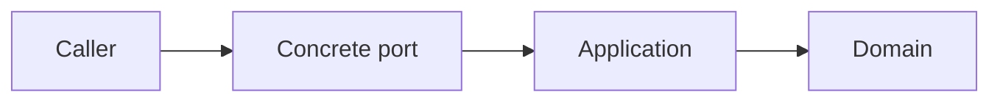
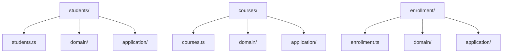

### Context Ports

A context port module defines the communication surface available at a context
boundary. A port module instantiates the adapters the context requires, injects
those adapters as dependencies into the application services that consume them,
and exposes classes, functions, or constants that other modules can import and
integrate. Each exported element represents a wired application capability the
context makes available beyond its own boundary.

In practice a port is a specific boundary element with identity: a command
handler, a query entry point, an event consumer, a published endpoint, or
another concrete interaction mechanism that the running system exposes.

Types and interfaces support the port definition but are secondary to the
exported elements. The primary concern is the concrete surface that another
module can import and call.

> **Hint**
> The generated `example.ts` file is only a placeholder. Replace it when
> the first real interaction of the context becomes clear.

#### Root Port File

The generated context starts with a single root file for ports.

```ts title="enrollment/example.ts"
export class Example {
    public doSomething(): void {
        // ...
    }
}
```

This placeholder marks the context root as the place where boundary-facing
capabilities are declared. Replace it with the first module that defines a real
port of the context when that capability becomes clear.

Context root `.ts` files belong to this same boundary surface. Each one is
expected to be a module that defines one or more context ports.

#### Naming

Neither the file nor the exported element needs to include the words "port" or
"ports". Prefer names that describe what the boundary capability does or
represents in the domain.

A file named `students.ts` exporting a class named `Roster` communicates more
than `students-port.ts` exporting `StudentsPort`. The suffix adds no meaning
that the class's methods and position in the context root do not already
provide.

Choose names that belong to the domain vocabulary of the context. If a name
reads naturally as part of the system's language, it is a better fit than a
name that reads as infrastructure.

#### First Port

In the following example we replace the placeholder with a concrete port for
managing students. The port wraps an application service and logs each
boundary operation.

```ts title="students/students.ts"
import { StudentsService } from './application/services.ts'
import { Student } from './domain/students.ts'
import { Email } from '../shared/domain/value-objects.ts'
import { FileLogger } from '../shared/adapters/loggers.ts'

export class Roster {
    protected readonly service: StudentsService
    protected readonly logger: FileLogger

    public constructor(service: StudentsService, logger: FileLogger) {
        this.service = service
        this.logger = logger
    }

    public all(): Record<string, unknown>[] {
        return this.service.all()
    }

    public create(data: { name: string, email: string }): boolean {
        const { name, email } = data

        const isCreated = this.service.create(new Student(name, Email.from(email)))

        if (isCreated === true) {
            this.logger.info({ action: 'create', context: 'students', name, email })
        } else {
            this.logger.warn({ action: 'create', context: 'students', name, email })
        }

        return isCreated
    }

    public delete(student: Student): boolean {
        const name = student.name
        const email = student.email.value

        const isDeleted = this.service.delete(student)

        if (isDeleted === true) {
            this.logger.info({ action: 'delete', context: 'students', name, email })
        } else {
            this.logger.warn({ action: 'delete', context: 'students', name, email })
        }

        return isDeleted
    }
}
```

`Roster` is a boundary object of the students context. Each method is one
concrete capability it exposes. The port constructs domain entities from raw
input, delegates to the service, and logs the result.

This is the normal flow inside the context boundary:


```mermaid
flowchart LR
    caller["Caller"] --> port[Concrete port]
    port --> application[Application]
    application --> domain[Domain]
```

The port belongs to the boundary because it is part of what the context
exposes. The application process executes the use case behind the exposed
capability and uses domain capabilities.

#### Multiple Port Files

As the system grows, each context can keep several port modules at its root.

```ts title="courses/courses.ts"
import { CoursesService } from './application/services.ts'
import { Course } from './domain/courses.ts'
import { FileLogger } from '../shared/adapters/loggers.ts'

export class Catalog {
    protected readonly service: CoursesService
    protected readonly logger: FileLogger

    public constructor(service: CoursesService, logger: FileLogger) {
        this.service = service
        this.logger = logger
    }

    public all(): Record<string, unknown>[] {
        return this.service.all()
    }

    public create(data: { name: string, description: string, hours: number }): boolean {
        const { name, description, hours } = data

        const isCreated = this.service.create(new Course(name, description, hours))

        if (isCreated === true) {
            this.logger.info({ action: 'create', context: 'courses', name, description, hours })
        } else {
            this.logger.warn({ action: 'create', context: 'courses', name, description, hours })
        }

        return isCreated
    }

    public delete(course: Course): boolean {
        const name = course.name

        const isDeleted = this.service.delete(course)

        if (isDeleted === true) {
            this.logger.info({ action: 'delete', context: 'courses', name })
        } else {
            this.logger.warn({ action: 'delete', context: 'courses', name })
        }

        return isDeleted
    }
}
```

```ts title="enrollment/enrollment.ts"
import { InscriptionsService } from './application/services.ts'
import { InscriptionAggregate } from './domain/inscriptions.ts'
import { FileLogger } from '../shared/adapters/loggers.ts'
import type { Student } from '../students/domain/students.ts'
import type { Course } from '../courses/domain/courses.ts'

export class Enrollment {
    protected readonly service: InscriptionsService
    protected readonly logger: FileLogger

    public constructor(service: InscriptionsService, logger: FileLogger) {
        this.service = service
        this.logger = logger
    }

    public all(): Record<string, unknown>[] {
        return this.service.all()
    }

    public enroll(student: Student, course: Course): boolean {
        const studentName = student.name
        const courseName = course.name

        const inscription = InscriptionAggregate.enroll(student, course)
        const isEnrolled = this.service.create(inscription)

        if (isEnrolled === true) {
            this.logger.info({ action: 'enroll', context: 'enrollment', student: studentName, course: courseName })
        } else {
            this.logger.warn({ action: 'enroll', context: 'enrollment', student: studentName, course: courseName })
        }

        return isEnrolled
    }

    public unenroll(student: Student, course: Course): boolean {
        const studentName = student.name
        const courseName = course.name

        const inscription = InscriptionAggregate.enroll(student, course)
        const isUnenrolled = this.service.delete(inscription)

        if (isUnenrolled === true) {
            this.logger.info({ action: 'unenroll', context: 'enrollment', student: studentName, course: courseName })
        } else {
            this.logger.warn({ action: 'unenroll', context: 'enrollment', student: studentName, course: courseName })
        }

        return isUnenrolled
    }
}
```

Another caller can then import the port from the file that owns it.

This arrangement is useful when one system exposes several independent
capabilities. A single file works well for a small context. Separate files
become easier to maintain when each port has its own identity and
responsibility.

> **Warning**
> A port module exposes boundary capabilities and instantiates adapters.
> Keep business rules in the domain layer, orchestration logic in the
> application layer, and infrastructure implementations in the adapters layer.

#### Example Layout

The following structure keeps ports at the root while the implementation lives
in the generated folders.


```mermaid
flowchart TD
    students["students/"] --> roster["students.ts"]
    students --> studentsDomain["domain/"]
    students --> studentsApp["application/"]

    courses["courses/"] --> catalog["courses.ts"]
    courses --> coursesDomain["domain/"]
    courses --> coursesApp["application/"]

    enrollment["enrollment/"] --> enrollmentPort["enrollment.ts"]
    enrollment --> enrollmentDomain["domain/"]
    enrollment --> enrollmentApp["application/"]
```

This layout keeps the context boundary visible from the top level. It also
makes each exposed capability easy to locate because the port modules stay at
the root of the context.

#### Next Step

After defining a port, implement the corresponding executable path and connect
it to an application service. The surrounding structure is described in
`library-structure.md`.
