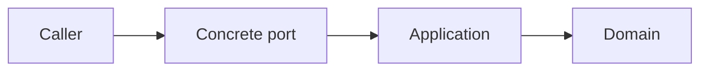
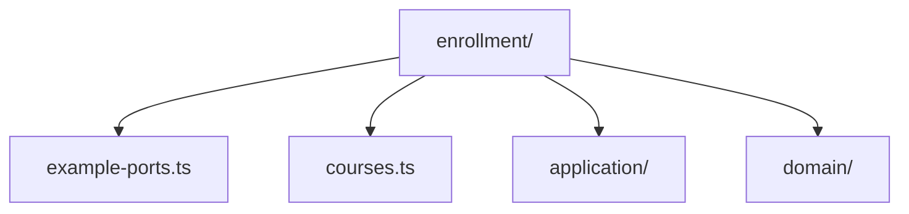

### Context Ports

Context ports define the communication available at a context boundary.
They describe which concrete capability a context exposes, what data enters
that capability, and what data it returns.

In practice a port is a specific boundary element of the system with identity:
a command handler, a query entry point, an event consumer, a published
endpoint, or another concrete interaction mechanism that exists because the
running system exposes it.

Types and interfaces still matter, but they are secondary. Their role is to
make the port explicit. The main concern is the port as a real executable
surface that another actor can call or observe.

> **Hint**
> The generated `example-ports.ts` file is only a placeholder. Replace it when
> the first real interaction of the context becomes clear.

#### Root Port File

The generated context starts with a single root file for ports.

```ts title="enrollment/example-ports.ts"
export class ExamplePort {
    public doSomething(): void {
        // ...
    }
}
```

This placeholder marks the context root as the place where boundary-facing
capabilities are declared. Replace it with the first module that defines a real
port of the context when that capability becomes clear.

Context root `.ts` files belong to this same boundary surface. Each one is
expected to be a module that defines one or more context ports.

#### First Port

In the following example we replace the placeholder with a concrete port for
managing course enrollments.

```ts title="enrollment/example-ports.ts"
import { InMemoryDatabaseDriver } from './application/database.ts'
import { Course } from './domain/courses.ts'
import { Student } from './domain/students.ts'
import { InscriptionAggregate } from './domain/inscriptions.ts'

const database: Record<string, Record<string, unknown>[]> = {}

export class Example {
    [property: string]: unknown

    private readonly driver: InMemoryDatabaseDriver

    constructor() {
        this.driver = new InMemoryDatabaseDriver(database)
    }

    public createStudent(student: Student) {
        const result = this.driver.connect('students').create(student.toJSON())
        this.driver.disconnect()
        return result
    }

    public createCourse(course: Course) {
        const result = this.driver.connect('courses').create(course.toJSON())
        this.driver.disconnect()
        return result
    }

    public listInscriptions() {
        const result = this.driver.connect('inscriptions').all()
        this.driver.disconnect()
        return result
    }

    public createInscription(student: Student, course: Course) {
        const inscription = InscriptionAggregate.enroll(student, course)
        const result = this.driver.connect('inscriptions').create(inscription.toJSON())
        this.driver.disconnect()
        return result
    }
}
```

`Example` is a boundary object of the context. Each static method is one
concrete capability it exposes. The port connects the boundary to a driver,
uses domain concepts internally, and keeps infrastructure details out of the
caller.

This is the normal flow inside the context boundary:


```mermaid
flowchart LR
    caller["Caller"] --> port[Concrete port]
    port --> application[Application]
    application --> domain[Domain]
```

The port belongs to the boundary because it is part of what the context
exposes. The application process executes the use case behind the exposed
capability and uses domain capabilities.

#### Multiple Port Files

As the context grows, you can keep several port modules at the context root.

```ts title="enrollment/courses.ts"
import { CoursesService } from './application/services.ts'
import { Course } from './domain/courses.ts'

export class CoursesPort {
    constructor(private readonly service: CoursesService) {}

    public all(): Record<string, unknown>[] {
        return this.service.all()
    }

    public create(name: string, description: string, hours: number): boolean {
        return this.service.create(new Course(name, description, hours))
    }

    public delete(course: Course): boolean {
        return this.service.delete(course)
    }
}
```

Another caller can then import the port from the file that owns it.

This arrangement is useful when one context exposes several independent
capabilities. A single file works well for a small context. Separate files
become easier to maintain when each port has its own identity and
responsibility.

> **Warning**
> A port should define an exposed boundary capability.
> Keep business rules, repository logic, and infrastructure details in their
> corresponding layers.

#### Example Layout

The following structure keeps ports at the root while the implementation lives
in the generated folders.


```mermaid
flowchart TD
    enrollment["enrollment/"] --> examplePort["example-ports.ts"]
    enrollment --> courses["courses.ts"]
    enrollment --> application["application/"]
    enrollment --> domain["domain/"]
```

This layout keeps the context boundary visible from the top level. It also
makes each exposed capability easy to locate because the port modules stay at
the root of the context.

#### Next Step

After defining a port, implement the corresponding executable path and connect
it to an application service. The surrounding structure is described in
`library-structure.md`.
