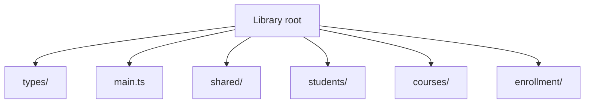
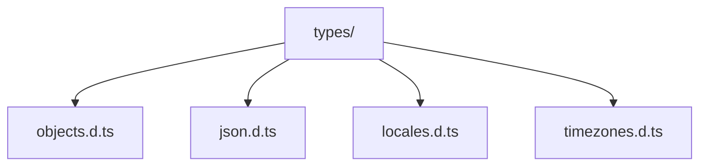
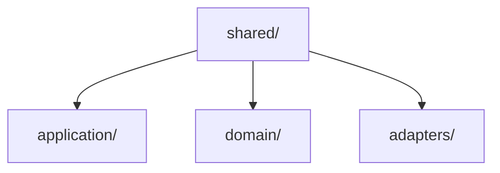
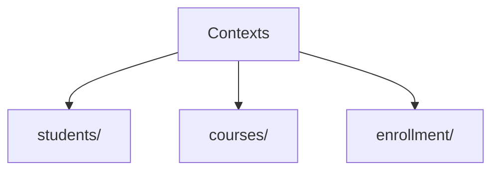
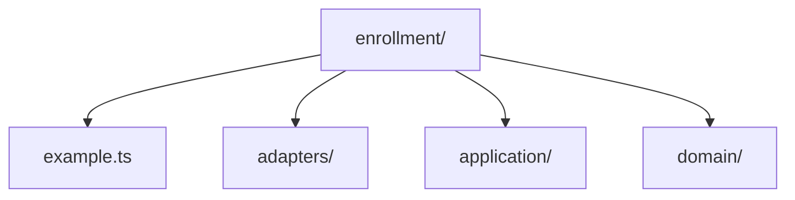
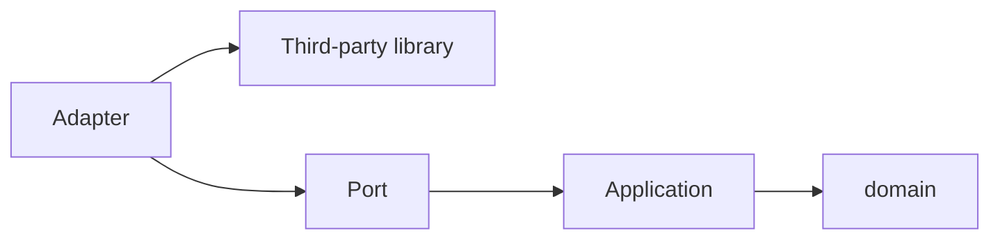
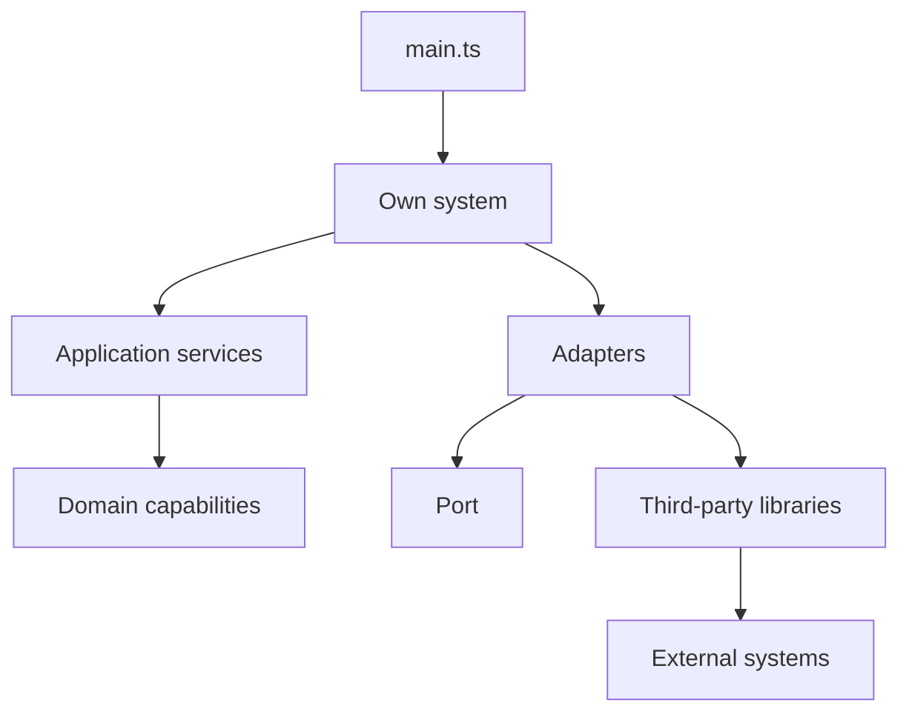

### Library Structure

The library structure organizes generated code into root files, shared
capabilities, and one or more contexts.
Each level has a distinct responsibility so that domain rules, use cases, and
integrations do not collapse into the same place.

This structure is used to keep the implementation centered on capabilities.
Shared code holds common abstractions. Contexts hold application-specific
language, rules, and operations.

#### Root

The root contains the entry points of the generated library.



`types/` groups the root-level type declarations. `main.ts` wires the
dependency injection container and runs the application. The rest of the
structure lives under `shared/` and one or more context directories.

#### Types

The `types/` directory contains ambient type declarations shared by the whole
library.



`types/objects.d.ts` defines root-level types such as `Generic<T>`.
`types/json.d.ts` defines `JsonValue` and the other plain, serializable JSON
shapes. `types/locales.d.ts` declares the `Locale` union from Unicode CLDR.
`types/timezones.d.ts` declares the `TimeZone` union from the IANA time zone
database.

#### Shared

The `shared` directory contains concepts that can be reused by multiple
contexts.



`shared/domain` contains modeling foundations such as value objects, entities,
aggregates, and errors. `shared/application` contains contracts for services,
validations, events, logging, HTTP boundaries, and data access.
`shared/adapters` contains concrete adapter implementations shared across
contexts, such as the in-memory database driver and manager.

Move code to `shared` only when its meaning belongs to more than one context.
Until then, keep it close to the context that owns the rule.

#### Contexts

A context groups the vocabulary, rules, and operations of one application
capability.



Each context can evolve independently while still reusing the abstractions from
`shared`. This separation reduces accidental coupling between unrelated parts of
the system.

#### Context Layout

Every generated context starts with the same internal structure.



`example.ts` is an example module in the root communication surface of
the context.
`domain/` contains capabilities and rules. `application/` contains processes.
`adapters/` contains integrations that wrap third-party libraries or context
ports.

Context root `.ts` files belong to the boundary surface of the context. Each
one instantiates the adapters the context requires, injects those adapters as
dependencies into the application services that consume them, and exposes
classes, functions, or constants as integration points for other modules.

#### Domain

The domain layer contains the context's capabilities. This layer models
concepts that carry business meaning: value objects, entities, aggregates, and
the rules that make them valid.

Domain code is execution-context agnostic. The same domain module runs
unchanged in a backend service, a browser application, or a mobile application
because domain code references only the business concepts it models. This
property makes domain code transferable across execution environments without
modification.

Typical domain responsibilities include validating an email address, identifying
an entity, changing the state of an order, or grouping related entities into a
single unit.

#### Application

The application layer contains processes that use domain capabilities to
fulfill a system purpose. Unlike the domain layer, the application layer carries
the execution context of the system.

A service in this layer may include logic specific to the execution environment
where it runs. A backend service may handle HTTP request data or coordinate
database transactions. A browser service may interact with browser storage or
browser-specific APIs. A mobile application service may integrate with device
capabilities. These differences reflect the application layer's responsibility:
to orchestrate domain capabilities within a given execution context.

A service in this layer coordinates collaborators: it validates input,
constructs domain objects, reads or writes data through abstractions, publishes
events, and logs results.

#### Adapters

The adapters layer contains the integrations that connect a context to external
systems. An adapter wraps a third-party library so that the context can interact
with a concrete transport or infrastructure path. An adapter can implement an
HTTP handler, consume a message, call a remote API, implement a data driver, or
connect to an event bus. Adapters are instantiated in port modules, which
compose them with application services and expose the resulting capability at
the context boundary.

#### Ports

Port modules define the communication surface available at the context boundary.
Port modules live at the context root. Each port module instantiates the
adapters the context requires, injects those adapters as dependencies into the
application services that consume them, and exposes classes, functions, or
constants that other modules can import and use. Each exported element
represents a wired application capability the context makes available to callers
outside its boundary.

The generated template starts with `example.ts`. As the context grows,
additional context root `.ts` modules can define more ports. The detailed
guidance for that layout lives in `context-ports.md`.

#### Dependency Direction

The normal dependency direction is the following:



This direction keeps the domain layer isolated from transport and infrastructure
details. Adapters integrate with external libraries. Port modules instantiate
adapters, inject them into application services, and connect the context
boundary to the resulting wired processes. The deeper a layer is, the more
execution-context agnostic it remains.

> **Warning**
> Domain code must remain execution-context agnostic. A domain object that
> imports HTTP, database, framework, or runtime-specific modules binds itself to
> one execution environment and loses portability across environments.

#### Example Flow

The following diagram shows the runtime flow of a typical operation.



`main.ts` is the runtime entry point into the own system. Inside that system,
application services use domain capabilities, while adapters can depend on
ports and third-party libraries.

```ts title="main.ts"
import { Container } from './shared/application/providers.ts'
import { InMemoryDatabaseDriver } from './shared/adapters/database.ts'
import { InMemoryDatabaseManager } from './shared/adapters/managers.ts'
import { FileLogger } from './shared/adapters/loggers.ts'

import { StudentsRepository } from './students/application/repositories.ts'
import { StudentsService } from './students/application/services.ts'
import { Roster } from './students/students.ts'
import { Student } from './students/domain/students.ts'

import { CoursesRepository } from './courses/application/repositories.ts'
import { CoursesService } from './courses/application/services.ts'
import { Catalog } from './courses/courses.ts'
import { Course } from './courses/domain/courses.ts'

import { InscriptionsRepository } from './enrollment/application/repositories.ts'
import { InscriptionsService } from './enrollment/application/services.ts'
import { Enrollment } from './enrollment/enrollment.ts'

import { Email } from './shared/domain/value-objects.ts'

const logger = new FileLogger('app.log')

type Dependencies = {
  DatabaseDriver: InMemoryDatabaseDriver
  StudentsManager: InMemoryDatabaseManager
  StudentsRepository: StudentsRepository
  StudentsService: StudentsService
  CoursesManager: InMemoryDatabaseManager
  CoursesRepository: CoursesRepository
  CoursesService: CoursesService
  InscriptionsManager: InMemoryDatabaseManager
  InscriptionsRepository: InscriptionsRepository
  InscriptionsService: InscriptionsService
}

const container = new Container<Dependencies>()

container.register({
  DatabaseDriver: {
    factory: () => new InMemoryDatabaseDriver({})
  },
  StudentsManager: {
    factory: (resolver) =>
      resolver.resolve('DatabaseDriver').connect('students')
  },
  StudentsRepository: {
    factory: (resolver) =>
      new StudentsRepository(resolver.resolve('StudentsManager'))
  },
  StudentsService: {
    factory: (resolver) =>
      new StudentsService(
        resolver.resolve('StudentsManager'),
        resolver.resolve('StudentsRepository')
      )
  },
  CoursesManager: {
    factory: (resolver) =>
      resolver.resolve('DatabaseDriver').connect('courses')
  },
  CoursesRepository: {
    factory: (resolver) =>
      new CoursesRepository(resolver.resolve('CoursesManager'))
  },
  CoursesService: {
    factory: (resolver) =>
      new CoursesService(
        resolver.resolve('CoursesManager'),
        resolver.resolve('CoursesRepository')
      )
  },
  InscriptionsManager: {
    factory: (resolver) =>
      resolver.resolve('DatabaseDriver').connect('inscriptions')
  },
  InscriptionsRepository: {
    factory: (resolver) =>
      new InscriptionsRepository(resolver.resolve('InscriptionsManager'))
  },
  InscriptionsService: {
    factory: (resolver) =>
      new InscriptionsService(
        resolver.resolve('InscriptionsManager'),
        resolver.resolve('InscriptionsRepository')
      )
  }
})

const studentsService = container.resolve('StudentsService')
const coursesService = container.resolve('CoursesService')
const inscriptionsService = container.resolve('InscriptionsService')

const roster = new Roster(studentsService, logger)
const catalog = new Catalog(coursesService, logger)
const enrollment = new Enrollment(inscriptionsService, logger)

roster.create({ name: 'Alice', email: 'alice@example.com' })
roster.create({ name: 'Bob', email: 'bob@example.com' })

catalog.create({ name: 'TypeScript', description: 'Learn TypeScript', hours: 40 })
catalog.create({ name: 'Clean Architecture', description: 'Hexagonal patterns', hours: 20 })

const alice = new Student('Alice', Email.from('alice@example.com'))
const typescript = new Course('TypeScript', 'Learn TypeScript', 40)

enrollment.enroll(alice, typescript)

console.log('students:', roster.all())
console.log('courses:', catalog.all())
console.log('inscriptions:', enrollment.all())
```

#### Next Step

Use this structure as the default layout for new code. When you need to inspect
the purpose of a generated file, consult `generated-file-reference.md`.
