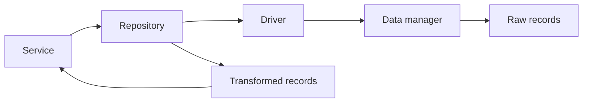

### Data

The data contracts define how the application layer interacts with plain source
records.
They separate connection management, raw record access, and domain
transformation so that a context can change drivers without rewriting its use
cases.

The generated structure splits this concern into three files:

1. `drivers.ts` for connection adapters;
2. `managers.ts` for plain-record operations;
3. `repositories.ts` for record-to-domain transformation.

#### Driver Adapter

`DriverAdapter` is responsible for connecting to a data source and returning an
enabled `DataManager`.

```ts title="shared/application/data/drivers.ts"
import { DataManager } from './managers.js'

export abstract class DriverAdapter<M extends DataManager = DataManager> {
    public abstract connect(...args: unknown[]): Promise<M>

    public abstract disconnect(): Promise<unknown>
}
```

The `connect()` method returns a manager that can read or manipulate raw data.
The `disconnect()` method closes the interaction when the work is finished.

#### Data Manager

`DataManager` is responsible for exposing plain source data.

```ts title="shared/application/data/managers.ts"
export abstract class DataManager<T = Record<string, unknown>> {
    public none(): Array<T> {
        return []
    }

    public abstract all(): Promise<Array<T>>
}
```

The base class provides `none()` as an explicit empty result and requires
`all()` for retrieving records. The generated template also includes operation
contracts such as `Filterable`, `Creatable`, and `Updatable`, plus the
`DatasetManager` extension for set operations.

#### First Implementation

In the following example we implement an in-memory manager and its driver.

```ts title="users/adapters/memory-users-driver.ts"
import { DriverAdapter } from '../../shared/application/data/drivers.js'
import { DataManager } from '../../shared/application/data/managers.js'

type UserRecord = {
    id: string
    email: string
    active: boolean | null
}

class MemoryUsersManager extends DataManager<UserRecord> {
    public constructor(private readonly rows: Array<UserRecord>) {
        super()
    }

    public async all(): Promise<Array<UserRecord>> {
        return this.rows
    }
}

export class MemoryUsersDriver extends DriverAdapter<MemoryUsersManager> {
    public constructor(private readonly rows: Array<UserRecord>) {
        super()
    }

    public async connect(): Promise<MemoryUsersManager> {
        return new MemoryUsersManager(this.rows)
    }

    public async disconnect(): Promise<void> {
        return undefined
    }
}
```

`MemoryUsersDriver` owns the connection contract. `MemoryUsersManager` owns the
raw records. The application layer can use both without knowing whether the
source is memory, SQL, or an HTTP-backed adapter.

#### Repository

`Repository` is responsible for transforming raw records into domain-oriented
representations.

```ts title="shared/application/data/repositories.ts"
import { type DataManager } from './managers.js'
import { type DriverAdapter } from './drivers.js'

export abstract class Repository<
    DataShape extends Record<string, unknown> = Record<string, unknown>,
    EntityShape extends Record<string, unknown> = Record<string, unknown>
> {
    public constructor(public readonly driver: DriverAdapter<DataManager<DataShape>>) {}

    public async all(): Promise<Array<EntityShape>> {
        const connection = await this.driver.connect()
        const raw = await connection.all()
        const entities = this.transformList(raw)
        await this.driver.disconnect()
        return entities
    }

    protected transformList(data: Array<DataShape>): Array<EntityShape> {
        return data.map(this.transform)
    }

    protected abstract transform(data: DataShape): EntityShape
}
```

The base repository already defines the `all()` flow. A concrete repository only
needs to implement `transform()`.

#### Repository Implementation

Now that the driver exists, a repository can translate raw records into a shape
that the rest of the context can use.

```ts title="users/adapters/users-repository.ts"
import { Repository } from '../../shared/application/data/repositories.js'
import { DriverAdapter } from '../../shared/application/data/drivers.js'
import { DataManager } from '../../shared/application/data/managers.js'

type UserRecord = {
    id: string
    email: string
    active: boolean | null
}

type UserView = {
    id: string
    email: string
    active: boolean | null
}

export class UsersRepository extends Repository<UserRecord, UserView> {
    public constructor(driver: DriverAdapter<DataManager<UserRecord>>) {
        super(driver)
    }

    protected transform(data: UserRecord): UserView {
        return {
            id: data.id,
            email: data.email,
            active: data.active,
        }
    }
}
```

This repository does not own the connection lifecycle because `Repository`
already handles it. Its responsibility is the mapping between raw source data
and the representation used by the context.

> **Warning**
> The generated `Repository` only implements `all()`. If the project needs
> filtering, creation, or updates, add those operations explicitly instead of
> assuming they already exist in the base class.

#### Example Flow

The normal flow of the data abstractions is the following:



This separation keeps the application service focused on orchestration while
the repository focuses on transformation.
