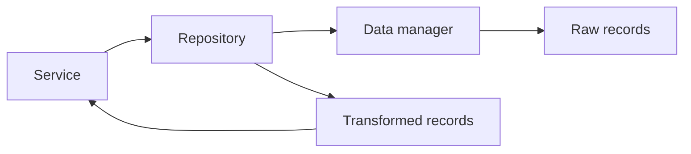

### Data

The data contracts define how the application layer interacts with plain source
records. They separate connection management, raw record access, and domain
transformation so that a context can change drivers without rewriting its use
cases.

The generated structure splits this concern into four files:

1. `capabilities.ts` for operation capability interfaces;
2. `drivers.ts` for connection adapters;
3. `managers.ts` for plain-record operations;
4. `repositories.ts` for record-to-domain transformation.

#### Capabilities

`capabilities.ts` declares the operation interfaces that a manager implements
to advertise what it supports.

```ts title="shared/application/data/capabilities.ts"
export interface Listable<DataShape extends Generic = Generic> {
    all(): DataShape[]
}

export interface Creatable<DataShape extends Generic = Generic, Feedback = unknown> {
    create(data: DataShape): Feedback
}

export interface Deletable<Selector = unknown, Feedback = unknown> {
    delete(selector: Selector): Feedback
}

// Also available: Filterable, Sortable, Updatable, Aggregatable, Relatable
```

Implement only the interfaces that the manager actually supports. Adding
`Creatable` to a class makes the creation capability explicit and discoverable
without adding it to the base class.

#### Data Manager

`DataManager` is the base contract for any data source. `DatasetManager`
extends it with set operations for contexts that need to combine collections.

```ts title="shared/application/data/managers.ts"
export abstract class DataManager<T = Record<string, unknown>> {
    [property: string]: unknown
}

export abstract class DatasetManager<T = Record<string, unknown>> extends DataManager<T> {
    [property: string]: unknown

    public abstract union(other: Array<T>): Array<T>
    public abstract intersection(other: Array<T>): Array<T>
    public abstract difference(other: Array<T>): Array<T>
    public abstract symmetricDifference(other: Array<T>): Array<T>
    public abstract complement(other: Array<T>): Array<T>
}
```

Extend `DataManager` to implement a concrete data source. The manager exposes
raw data without domain transformation.

The following adapter extends `DataManager` and implements `Listable`,
`Creatable`, and `Deletable` against a plain array held in memory.

```ts title="shared/adapters/managers.ts"
import { DataManager } from '../application/data/managers.ts'
import type { Listable, Creatable, Deletable } from '../application/data/capabilities.ts'

type Generic = Record<string, unknown>

export class InMemoryDatabaseManager
    extends DataManager
    implements Listable, Creatable, Deletable
{
    [property: string]: unknown

    protected records: Generic[]

    public constructor(records: Generic[]) {
        super()

        this.records = records
    }

    public all(): Generic[] {
        return this.records
    }

    public create(data: Generic): boolean {
        this.records.push(data)
        return true
    }

    public delete(selector: Partial<Generic>): boolean {
        const before = this.records.length

        this.records = this.records.filter((record) =>
            Object.entries(selector).every((entry) => {
                const [key, value] = entry
                return record[key] !== value
            })
        )

        return this.records.length < before
    }
}
```

#### Driver Adapter

`DriverAdapter` is responsible for connecting to a data source and returning an
enabled `DataManager`.

```ts title="shared/application/data/drivers.ts"
export abstract class DriverAdapter<M extends DataManager = DataManager> {
    [property: string]: unknown

    public abstract connect(...args: unknown[]): M

    public abstract disconnect(): unknown
}
```

Extend `DriverAdapter` to wrap a concrete data source. The driver connects to
the source, returns an enabled manager, and disconnects when the work is done.

The following adapter wraps the in-memory manager. It routes each connection
to a named collection within a shared plain-object database.

```ts title="shared/adapters/database.ts"
import { DriverAdapter } from '../application/data/drivers.ts'
import { InMemoryDatabaseManager } from './managers.ts'

type Generic = Record<string, unknown>

export type Database = Record<string, Generic[]>

export class InMemoryDatabaseDriver extends DriverAdapter<InMemoryDatabaseManager> {
    [property: string]: unknown

    protected manager: InMemoryDatabaseManager | null = null
    protected readonly database: Database

    public constructor(database: Database) {
        super()

        this.database = database
    }

    public override connect(collectionKey: string): InMemoryDatabaseManager {
        if (this.database[collectionKey] === undefined) {
            this.database[collectionKey] = []
        }

        this.manager = new InMemoryDatabaseManager(this.database[collectionKey])
        return this.manager
    }

    public override disconnect(): void {
        this.manager = null
    }
}
```

`InMemoryDatabaseDriver` owns the connection contract. `InMemoryDatabaseManager`
owns the raw records. The application layer can use both without knowing whether
the source is memory, SQL, or an HTTP-backed adapter.

#### Repository

`Repository` is responsible for transforming raw records into domain-oriented
representations. It holds a reference to the manager and requires `transform()`
to map a raw record into a domain entity.

```ts title="shared/application/data/repositories.ts"
export abstract class Repository<
    RawDataShape = Generic,
    EntityShape = Generic,
    M extends DataManager<RawDataShape> = DataManager<RawDataShape>
> {
    [property: string]: unknown

    public constructor(public readonly manager: M) {}

    protected abstract transform(data: RawDataShape, ...args: unknown[]): EntityShape
}
```

Data retrieval operations are not defined in the base class — add them
explicitly in the concrete class using the capability interfaces from
`capabilities.ts`.

Each context provides its own repository. The following examples show how
`StudentsRepository`, `CoursesRepository`, and `InscriptionsRepository` extend
the base class with operations specific to their domain entities.

```ts title="students/application/repositories.ts"
import { Repository } from '../../shared/application/data/repositories.ts'
import { InMemoryDatabaseManager } from '../../shared/adapters/managers.ts'
import { Student } from '../domain/students.ts'
import { Email } from '../../shared/domain/value-objects.ts'

type StudentData = ReturnType<Student['toJSON']>

export class StudentsRepository extends Repository<StudentData, Student, InMemoryDatabaseManager> {
    [property: string]: unknown

    public constructor(manager: InMemoryDatabaseManager) {
        super(manager)
    }

    protected override transform(data: StudentData): Student {
        return new Student(data.name, Email.from(data.email))
    }

    public create(student: Student): boolean {
        return this.manager.create(student.toJSON())
    }

    public delete(student: Student): boolean {
        return this.manager.delete(student.toJSON())
    }
}
```

```ts title="courses/application/repositories.ts"
import { Repository } from '../../shared/application/data/repositories.ts'
import { InMemoryDatabaseManager } from '../../shared/adapters/managers.ts'
import { Course } from '../domain/courses.ts'

type CourseData = ReturnType<Course['toJSON']>

export class CoursesRepository extends Repository<CourseData, Course, InMemoryDatabaseManager> {
    [property: string]: unknown

    public constructor(manager: InMemoryDatabaseManager) {
        super(manager)
    }

    protected override transform(data: CourseData): Course {
        return new Course(data.name, data.description, data.durationHours)
    }

    public create(course: Course): boolean {
        return this.manager.create(course.toJSON())
    }

    public delete(course: Course): boolean {
        return this.manager.delete(course.toJSON())
    }
}
```

```ts title="enrollment/application/repositories.ts"
import { Repository } from '../../shared/application/data/repositories.ts'
import { InMemoryDatabaseManager } from '../../shared/adapters/managers.ts'
import { Inscription } from '../domain/inscriptions.ts'
import type { Student } from '../../students/domain/students.ts'
import type { Course } from '../../courses/domain/courses.ts'

type InscriptionData = ReturnType<Inscription['toJSON']>

export class InscriptionsRepository extends Repository<InscriptionData, Inscription, InMemoryDatabaseManager> {
    [property: string]: unknown

    public constructor(manager: InMemoryDatabaseManager) {
        super(manager)
    }

    protected override transform(data: InscriptionData, student: Student, course: Course): Inscription {
        return new Inscription(student, course, data.enrolledAt)
    }

    public create(inscription: Inscription): boolean {
        return this.manager.create(inscription.toJSON())
    }

    public delete(inscription: Inscription): boolean {
        return this.manager.delete(inscription.toJSON())
    }
}
```

#### Example Flow

The normal flow of the data abstractions is the following:


```mermaid
flowchart LR
    service[Service] --> repository[Repository]
    repository --> manager["Data manager"]
    manager --> raw["Raw records"]
    repository --> transformed["Transformed records"]
    transformed --> service
```

This separation keeps the application service focused on orchestration while
the repository focuses on transformation.
