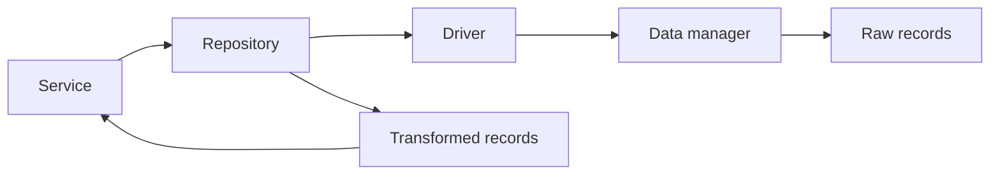

### Data

The data contracts define how the application layer interacts with plain source
records.
They separate connection management, raw record access, and domain
transformation so that a context can change drivers without rewriting its use
cases.

The generated structure splits this concern into four files:

1. `capabilities.ts` for operation capability interfaces;
2. `drivers.ts` for connection adapters;
3. `managers.ts` for plain-record operations;
4. `repositories.ts` for record-to-domain transformation.

#### Capabilities

`capabilities.ts` declares the operation interfaces that a manager or repository
can implement to advertise what it supports.

```ts title="shared/application/data/capabilities.ts"
export interface Listable {
    all(): Generic | Promise<Generic[]>
}

export interface Filterable {
    filter(selector: unknown): Generic | Promise<Generic[]>
}

export interface Sortable {
    sort(selector: unknown): Generic | Promise<Generic[]>
}

export interface Creatable {
    create(data: unknown): unknown
}

export interface Updatable {
    update(selector: unknown, data: unknown): unknown
}

export interface Deletable {
    delete(selector: unknown): unknown
}

export interface Aggregatable {
    aggregate(selector: unknown): unknown
}

export interface Relatable {
    selectRelated(...args: unknown[]): unknown
    prefetchRelated(...args: unknown[]): unknown
}
```

Implement only the interfaces that the manager actually supports. Adding
`Filterable` to a class makes the filtering capability explicit and
discoverable without adding it to the base class.

#### Driver Adapter

`DriverAdapter` is responsible for connecting to a data source and returning an
enabled `DataManager`.

```ts title="shared/application/data/drivers.ts"
import { DataManager } from './managers.js'

export abstract class DriverAdapter<M extends DataManager = DataManager> {
    public abstract connect(...args: unknown[]): Promise<M>

    public abstract disconnect(): Promise<unknown>
}
```

The `connect()` method returns a manager that can read or manipulate raw data.
The `disconnect()` method closes the interaction when the work is finished.

#### Data Manager

`DataManager` is responsible for exposing plain source data.

```ts title="shared/application/data/managers.ts"
export abstract class DataManager<T = Record<string, unknown>> {
    [property: string]: unknown
}

export abstract class DatasetManager<T = Record<string, unknown>> extends DataManager<T> {
    [property: string]: unknown

    public abstract union(other: Array<T>): Promise<Array<T>>
    public abstract intersection(other: Array<T>): Promise<Array<T>>
    public abstract difference(other: Array<T>): Promise<Array<T>>
    public abstract symmetricDifference(other: Array<T>): Promise<Array<T>>
    public abstract complement(other: Array<T>): Promise<Array<T>>
}
```

`DataManager` is the base contract for any data source. `DatasetManager` extends
it with set operations for contexts that need to combine collections.
Add operation capabilities from `capabilities.ts` to concrete implementations
as needed.

#### Implementation

In the following example we implement an in-memory manager and its driver.

```ts title="users/adapters/memory-users-driver.ts"
import { DriverAdapter } from '../../shared/application/data/drivers.js'
import { DataManager } from '../../shared/application/data/managers.js'

type UserRecord = {
    id: string
    email: string
    active: boolean | null
}

class MemoryUsersManager extends DataManager<UserRecord> {
    public constructor(private readonly rows: Array<UserRecord>) {
        super()
    }

    public async all(): Promise<Array<UserRecord>> {
        return this.rows
    }
}

export class MemoryUsersDriver extends DriverAdapter<MemoryUsersManager> {
    public constructor(private readonly rows: Array<UserRecord>) {
        super()
    }

    public async connect(): Promise<MemoryUsersManager> {
        return new MemoryUsersManager(this.rows)
    }

    public async disconnect(): Promise<void> {
        return undefined
    }
}
```

`MemoryUsersDriver` owns the connection contract. `MemoryUsersManager` owns the
raw records. The application layer can use both without knowing whether the
source is memory, SQL, or an HTTP-backed adapter.

Put all your complex data operations in `DataManager`. `Repository` should only handle the transformation of raw records into domain representations. For example, if you need to relate users to their posts, implement that in a manager:

```ts
class ComplexUsersManager extends DataManager<EnrichedUserRecord> {
    ...

    public async findAllAndRelate(): Promise<Array<EnrichedUserRecord>> {
        ...
    }
}
```

#### Repository

`Repository` is responsible for transforming raw records into domain-oriented
representations.

```ts title="shared/application/data/repositories.ts"
import { type DataManager } from './managers.js'
import { type DriverAdapter } from './drivers.js'

export abstract class Repository<RawDataShape = Generic, EntityShape = Generic> {
    [property: string]: unknown

    public constructor(
        public readonly driver: DriverAdapter<DataManager<RawDataShape>>
    ) {}

    protected abstract transform(data: RawDataShape): EntityShape
}
```

The base repository holds the driver and requires `transform()` to map a raw
record into a domain representation. Data retrieval operations are not defined
in the base class — add them explicitly in the concrete class using the
capability interfaces from `capabilities.ts`.

#### Repository Implementation

A concrete repository extends the base class, declares the driver type, and
implements `transform()`. Add capability interfaces for any additional operations.

```ts title="users/adapters/users-repository.ts"
import { Repository } from '../../shared/application/data/repositories.js'
import { type Listable, type Filterable } from '../../shared/application/data/capabilities.js'
import { DriverAdapter } from '../../shared/application/data/drivers.js'
import { DataManager } from '../../shared/application/data/managers.js'

type UserRecord = { id: string; email: string; active: boolean | null }
type UserView   = { id: string; email: string; active: boolean | null }

export class UsersRepository
    extends Repository<UserRecord, UserView>
    implements Listable, Filterable
{
    public constructor(driver: DriverAdapter<DataManager<UserRecord>>) {
        super(driver)
    }

    public async all(): Promise<UserView[]> {
        const connection = await this.driver.connect()
        const raw = await (connection as DataManager<UserRecord> & Listable).all()
        await this.driver.disconnect()
        return (raw as UserRecord[]).map(this.transform)
    }

    public async filter(selector: unknown): Promise<UserView[]> {
        // implementation
        return []
    }

    protected transform(data: UserRecord): UserView {
        return { id: data.id, email: data.email, active: data.active }
    }
}
```

The repository declares what it supports through capabilities. Operations are
explicit, not inherited from the base class.

#### Example Flow

The normal flow of the data abstractions is the following:


```mermaid
flowchart LR
    service[Service] --> repository[Repository]
    repository --> driver[Driver]
    driver --> manager["Data manager"]
    manager --> raw["Raw records"]
    repository --> transformed["Transformed records"]
    transformed --> service
```

This separation keeps the application service focused on orchestration while
the repository focuses on transformation.
