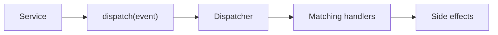

### Events

Events represent something that occurred in the application.
They are used to make side effects explicit and to separate the main process
from the reactions that can happen after that process completes.

The generated template defines three contracts: `Event`, `EventHandler`, and
`EventDispatcher`.

#### Event

`Event` is responsible for carrying the event time and its plain details.

```ts title="shared/application/events.ts"
export abstract class Event {
	public constructor(
		public readonly timestamp: number = Date.now(),
		public readonly details: Record<string, unknown> = {},
	) {}
}
```

Every event instance includes a timestamp and a `details` object. Concrete
events can extend this base class directly when the generic `details` payload is
enough for the process.

#### First Event

In the following example we define an event for user registration.

```ts title="users/application/user-registered.ts"
import { Event } from '../../shared/application/events.js'

export class UserRegisteredEvent extends Event {}

const event = new UserRegisteredEvent(Date.now(), {
	userId: 'usr_1',
	email: 'ada@example.com',
})
```

`UserRegisteredEvent` does not need additional code because the generated base
class already stores the time and the details.

#### Event Handler

`EventHandler` is responsible for reacting to an event.

```ts title="shared/application/events.ts"
export abstract class EventHandler {
	public abstract handle(event: Event): Promise<void>
}
```

Now that the event exists, a handler can implement the required `handle()`
method.

```ts title="users/adapters/send-welcome-email.ts"
import { Event, EventHandler } from '../../shared/application/events.js'

export class SendWelcomeEmailHandler extends EventHandler {
	public async handle(event: Event): Promise<void> {
		const email = String(event.details.email)
		void email
	}
}
```

This example keeps the reaction minimal. In a real adapter, the handler would
call an email provider or another external system.

#### Event Dispatcher

`EventDispatcher` is responsible for subscription management and event
publication.

```ts title="shared/application/events.ts"
export abstract class EventDispatcher {
	public abstract subscribe(key: unknown, handler: EventHandler): void

	public abstract unsubscribe(key: unknown, handler: EventHandler): void

	public abstract dispatch(event: Event): void
}
```

In the following example we use an in-memory dispatcher.

```ts title="users/adapters/in-memory-dispatcher.ts"
import {
	Event,
	EventDispatcher,
	EventHandler,
} from '../../shared/application/events.js'

export class InMemoryDispatcher extends EventDispatcher {
	private readonly handlers = new Map<string, Array<EventHandler>>()

	public subscribe(key: unknown, handler: EventHandler): void {
		const normalizedKey = String(key)
		const existing = this.handlers.get(normalizedKey) ?? []
		this.handlers.set(normalizedKey, [...existing, handler])
	}

	public unsubscribe(key: unknown, handler: EventHandler): void {
		const normalizedKey = String(key)
		const existing = this.handlers.get(normalizedKey) ?? []
		this.handlers.set(
			normalizedKey,
			existing.filter((current) => current !== handler),
		)
	}

	public dispatch(event: Event): void {
		const key = event.constructor.name
		const handlers = this.handlers.get(key) ?? []

		for (const handler of handlers) {
			void handler.handle(event)
		}
	}
}
```

The dispatcher keeps the subscription mechanics outside the application service.
This allows the service to publish an event without knowing how reactions are
registered or executed.

> **Warning**
> The generated dispatcher contract does not define durability, retries, or
> ordering guarantees. If the application needs those guarantees, document and
> implement them in the concrete adapter.

#### Example Flow

The normal flow is the following:



This keeps the main process separate from secondary reactions.
