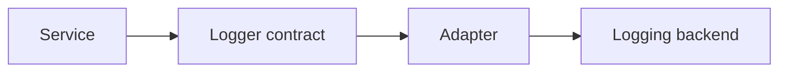

### Loggers

The logging contracts define how the application layer emits operational
information.
They are used to keep services independent from a concrete logging library or
transport.

The generated template provides shared level constants and the abstract
`Logger` contract.

#### Log Levels

The following constants describe the generated severity scale.

| Constant | Value |
| --- | --- |
| `DEBUG` | `10` |
| `INFO` | `20` |
| `WARNING` | `30` |
| `ERROR` | `40` |
| `CRITICAL` | `50` |

These values give the project a shared vocabulary for severity without forcing
any adapter to use a particular logger implementation.

#### Logger

`Logger` is responsible for receiving log data from the application layer.

```ts title="shared/application/loggers.ts"
import { type TimeZone } from '../../types/timezones.js'
import { type Locale } from '../../types/locales.js'

export abstract class Logger {
    [property: string]: unknown

    public name: string = 'main'

    public level: number = 0

    public datetimeLocales: Locale[] = ['en-GB']

    public datetimeFormatOptions: Intl.DateTimeFormatOptions & { timeZone: TimeZone } = {
        timeZone: 'UTC',
        year: 'numeric',
        month: '2-digit',
        day: '2-digit',
        hour: '2-digit',
        minute: '2-digit',
        second: '2-digit',
        fractionalSecondDigits: 3,
        hourCycle: 'h23'
    }

    public abstract debug(data: unknown): void

    public abstract info(data: unknown): void

    public abstract warning(data: unknown): void

    public abstract error(data: unknown): void

    public abstract critical(data: unknown): void

    protected getCurrentDatetime(): string {
        return new Date().toLocaleString(this.datetimeLocales, this.datetimeFormatOptions)
    }
} //:: class
```

The contract is intentionally small. It defines the actions the application can
request, while the adapter decides how those actions are persisted or displayed.

`name` and `level` identify the logger instance and its minimum severity, so an
adapter can decide which logs to emit or route. `datetimeLocales` and
`datetimeFormatOptions` control how `getCurrentDatetime()` formats the current
moment, using the `Locale` type from `types/locales.d.ts` (see
`types/locales.md`) and the `TimeZone` type from `types/timezones.d.ts` (see
`types/timezones.md`). Adapters can use `getCurrentDatetime()` to timestamp
log entries consistently, regardless of the runtime environment's own locale
or timezone.

#### First Adapter

In the following example we implement a console-based logger.

```ts title="users/adapters/console-logger.ts"
import { Logger } from '../../shared/application/loggers.js'

export class ConsoleLogger extends Logger {
	public debug(data: unknown): void {
		console.debug(this.getCurrentDatetime(), this.name, data)
	}

	public info(data: unknown): void {
		console.info(this.getCurrentDatetime(), this.name, data)
	}

	public warning(data: unknown): void {
		console.warn(this.getCurrentDatetime(), this.name, data)
	}

	public error(data: unknown): void {
		console.error(this.getCurrentDatetime(), this.name, data)
	}

	public critical(data: unknown): void {
		console.error(this.getCurrentDatetime(), this.name, data)
	}
}
```

This adapter satisfies the generated contract without changing the application
layer. It reuses `getCurrentDatetime()` to prefix every entry with a
consistently formatted timestamp.

#### Service Integration

Now that the logger exists, an application service can depend on the contract.

```ts title="users/application/register-user.ts"
import { Service } from '../../shared/application/services.js'
import { Logger } from '../../shared/application/loggers.js'

export class RegisterUser extends Service {
	public constructor(private readonly logger: Logger) {
		super()
	}

	public async execute(email: string): Promise<void> {
		this.logger.info({
			message: 'Registering user',
			email,
		})
	}
}
```

The service does not know whether the logger writes to the console, a file, or
an external platform. It only depends on the application-level contract.

> **Hint**
> Pass structured objects when the project needs machine-readable logs. The
> generated contract accepts `unknown`, so the adapter can enforce its own shape.

#### Example Flow



This flow keeps observability concerns outside the core process.
