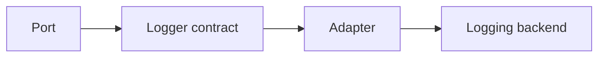

### Loggers

The logging contracts define how the application layer emits operational
information.
They are used to keep services independent from a concrete logging library or
transport.

The generated template provides shared level constants, the `Loggable`
interface, and the abstract `Logger` contract.

#### Log Levels

The following constants describe the generated severity scale.

| Constant | Value |
| --- | --- |
| `LOG` | `10` |
| `DEBUG` | `20` |
| `INFO` | `30` |
| `WARN` | `40` |
| `ERROR` | `50` |

These values give the project a shared vocabulary for severity without forcing
any adapter to use a particular logger implementation.

#### Loggable

`Loggable` declares the named log-level methods equivalent to the browser
console API.

```ts title="shared/application/loggers.ts"
export interface Loggable {
    log(data: unknown): void
    debug(data: unknown): void
    info(data: unknown): void
    warn(data: unknown): void
    error(data: unknown): void
}
```

Implement `Loggable` alongside `Logger` when the adapter wants to expose named
convenience methods to callers.

#### Logger

`Logger` is responsible for receiving log data from the application layer.
Subclasses implement `write()` to route entries to a specific output target.

```ts title="shared/application/loggers.ts"
export abstract class Logger {
    [property: string]: unknown

    public name: string = 'main'

    public level: number = 0

    public abstract write(level: number, data: unknown): void
}
```

`name` and `level` identify the logger instance and its minimum severity, so an
adapter can decide which logs to emit or route.

#### First Adapter

In the following example we implement a file-based logger that writes one
formatted line per entry and respects the configured level threshold.

```ts title="shared/adapters/loggers.ts"
import { Logger, Loggable, LOG, DEBUG, INFO, WARN, ERROR } from '../application/loggers.ts'

export class FileLogger extends Logger implements Loggable {
    [property: string]: unknown

    protected static readonly levelLabels: Record<number, string> = {
        [LOG]: 'LOG',
        [DEBUG]: 'DEBUG',
        [INFO]: 'INFO',
        [WARN]: 'WARN',
        [ERROR]: 'ERROR'
    }

    protected readonly filePath: string

    public constructor(filePath: string) {
        super()

        this.filePath = filePath
    }

    public log(data: unknown): void { this.write(LOG, data) }
    public debug(data: unknown): void { this.write(DEBUG, data) }
    public info(data: unknown): void { this.write(INFO, data) }
    public warn(data: unknown): void { this.write(WARN, data) }
    public error(data: unknown): void { this.write(ERROR, data) }

    public override write(level: number, data: unknown): void {
        if (level < this.level) return

        const timestamp = new Date().toISOString()
        const name = this.name
        const label = FileLogger.levelLabels[level] ?? String(level)
        const payload = typeof data === 'object' ? JSON.stringify(data) : String(data)
        const entry = `${timestamp} [${label}] (${name}) ${payload}\n`

        Deno.writeTextFileSync(this.filePath, entry, { append: true })
    }
}
```

This adapter satisfies the generated contract without changing the application
layer. It filters entries below the configured `level` threshold and formats
each line with an ISO timestamp, level label, and logger name.

#### Service Integration

Now that the logger exists, a context port can depend on it.

```ts title="students/students.ts"
import { StudentsService } from './application/services.ts'
import { Student } from './domain/students.ts'
import { Email } from '../shared/domain/value-objects.ts'
import { FileLogger } from '../shared/adapters/loggers.ts'

export class Roster {
    protected readonly service: StudentsService
    protected readonly logger: FileLogger

    public constructor(service: StudentsService, logger: FileLogger) {
        this.service = service
        this.logger = logger
    }

    public create(data: { name: string, email: string }): boolean {
        const { name, email } = data

        const isCreated = this.service.create(new Student(name, Email.from(email)))

        if (isCreated === true) {
            this.logger.info({ action: 'create', context: 'students', name, email })
        } else {
            this.logger.warn({ action: 'create', context: 'students', name, email })
        }

        return isCreated
    }
}
```

The port does not know whether the logger writes to a file, the console, or
an external platform. It only depends on the adapter reference received through
the constructor.

> **Hint**
> Pass structured objects when the project needs machine-readable logs. The
> generated contract accepts `unknown`, so the adapter can enforce its own shape.

#### Example Flow


```mermaid
flowchart LR
    port[Port] --> contract["Logger contract"]
    contract --> adapter[Adapter]
    adapter --> backend["Logging backend"]
```

This flow keeps observability concerns outside the core process.
