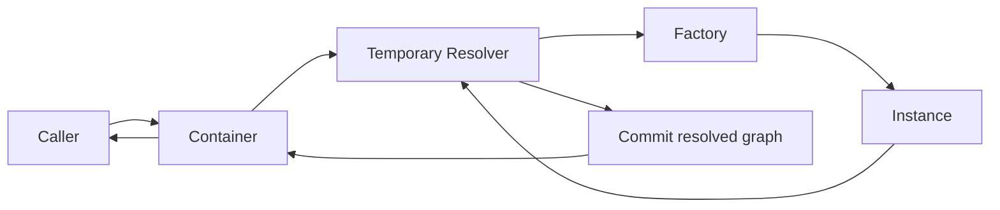

### Providers

`providers.ts` contains a dependency injection container that resolves object
instances as lazy singletons. It keeps collaborator wiring outside domain and
application code and preserves the dependency type associated with each token.

#### Dependency map

A dependency map defines the relationship between each string token and the
object instance returned for that token.

```ts title="shared/application/providers.ts"
type Dependencies = {
  DatabaseDriver: InMemoryDatabaseDriver
  StudentsManager: InMemoryDatabaseManager
  StudentsRepository: StudentsRepository
  StudentsService: StudentsService
}
```

Every dependency must be an object. Primitive values, `null`, and `undefined`
are not valid dependency instances. The factory return type is checked by
TypeScript and the resolver also rejects non-object results at runtime.

#### Registrations

`Registrations<T>` maps dependency tokens to factories. Each factory receives a
typed `DependencyResolver<T>` and must return the instance associated with its
token.

```ts title="shared/application/providers.ts"
export type Registrations<T extends DependencyMap<T>> = Partial<{
  [Token in DependencyToken<T>]: Registration<T, Token>
}>
```

The token determines the return type of `resolve`, so callers do not provide a
generic type argument manually.

```ts
const service = container.resolve('StudentsService')
// service: StudentsService
```

#### Storage

The container stores registrations in an object created with
`Object.create(null)` instead of a `Map` or a regular object. The registry has no
prototype, so tokens such as `__proto__`, `constructor`, and `hasOwnProperty`
behave like ordinary dependency tokens.

Each entry stores its factory and the cached singleton instance:

```ts title="shared/application/providers.ts"
interface ContainerEntry<T extends DependencyMap<T>> {
  readonly factory: Factory<T>
  readonly instance: T[DependencyToken<T>] | null
}
```

`null` represents an unresolved entry. It cannot conflict with a dependency
value because dependencies are restricted to object instances.

#### Container

`Container<T>` is the public registry and singleton cache.

```ts title="shared/application/providers.ts"
export class Container<T extends DependencyMap<T>> {
  register(entries: Registrations<T>): this
  resolve<Token extends DependencyToken<T>>(token: Token): T[Token]
  has(token: DependencyToken<T>): boolean
  unregister(token: DependencyToken<T>): boolean
  clear(): void
}
```

| Method | Description |
| --- | --- |
| `register(entries)` | Validates every registration before committing any entry. Throws when a token is already registered or a factory is invalid. |
| `resolve(token)` | Returns the singleton associated with the token. The factory runs only when the instance has not been resolved before. |
| `has(token)` | Returns whether the token is registered. |
| `unregister(token)` | Removes the token and its cached instance. It does not invalidate already-resolved dependents. |
| `clear()` | Removes every registration and cached instance. |

#### Atomic writes

Container mutations execute synchronously and do not yield control while they
are changing the registry. This keeps each mutation atomic even when callers
start operations from asynchronous workflows.

`register` prepares and validates all entries before writing them. If validation
fails, no registration from that call is committed.

`resolve` builds the dependency graph in a temporary resolver and commits the
resolved entries only after the complete graph succeeds. If any factory throws,
no partially resolved singleton from that graph is written to the container.

The container also rejects reentrant writes while another write is active. A
factory must resolve collaborators through the `DependencyResolver` it receives
instead of mutating the `Container` directly.

Factories are synchronous. An asynchronous factory is outside the container
contract and would require a different resolution transaction model.

#### Circular dependency detection

The temporary resolver tracks the active dependency path. If a factory requests
a token already being resolved in the same graph, it throws a
`CircularDependencyError` with the complete cycle.

```ts
interface Dependencies {
  ServiceA: ServiceA
  ServiceB: ServiceB
}

const container = new Container<Dependencies>()

container.register({
  ServiceA: {
    factory: (resolver) =>
      new ServiceA(resolver.resolve('ServiceB'))
  },
  ServiceB: {
    factory: (resolver) =>
      new ServiceB(resolver.resolve('ServiceA'))
  }
})

container.resolve('ServiceA')
// throws: Circular dependency detected: ServiceA -> ServiceB -> ServiceA
```

#### Usage

Declare the dependency map once, create a typed container, and register the
factories. Dependencies inside each factory are inferred from their tokens.

```ts title="main.ts"
import { Container } from './shared/application/providers.ts'
import { InMemoryDatabaseDriver } from './shared/adapters/database.ts'
import { InMemoryDatabaseManager } from './shared/adapters/managers.ts'

import { StudentsRepository } from './students/application/repositories.ts'
import { StudentsService } from './students/application/services.ts'

import { CoursesRepository } from './courses/application/repositories.ts'
import { CoursesService } from './courses/application/services.ts'

import { InscriptionsRepository } from './enrollment/application/repositories.ts'
import { InscriptionsService } from './enrollment/application/services.ts'

type Dependencies = {
  DatabaseDriver: InMemoryDatabaseDriver
  StudentsManager: InMemoryDatabaseManager
  StudentsRepository: StudentsRepository
  StudentsService: StudentsService
  CoursesManager: InMemoryDatabaseManager
  CoursesRepository: CoursesRepository
  CoursesService: CoursesService
  InscriptionsManager: InMemoryDatabaseManager
  InscriptionsRepository: InscriptionsRepository
  InscriptionsService: InscriptionsService
}

const container = new Container<Dependencies>()

container.register({
  DatabaseDriver: {
    factory: () => new InMemoryDatabaseDriver({})
  },
  StudentsManager: {
    factory: (resolver) =>
      resolver.resolve('DatabaseDriver').connect('students')
  },
  StudentsRepository: {
    factory: (resolver) =>
      new StudentsRepository(resolver.resolve('StudentsManager'))
  },
  StudentsService: {
    factory: (resolver) =>
      new StudentsService(
        resolver.resolve('StudentsManager'),
        resolver.resolve('StudentsRepository')
      )
  },
  CoursesManager: {
    factory: (resolver) =>
      resolver.resolve('DatabaseDriver').connect('courses')
  },
  CoursesRepository: {
    factory: (resolver) =>
      new CoursesRepository(resolver.resolve('CoursesManager'))
  },
  CoursesService: {
    factory: (resolver) =>
      new CoursesService(
        resolver.resolve('CoursesManager'),
        resolver.resolve('CoursesRepository')
      )
  },
  InscriptionsManager: {
    factory: (resolver) =>
      resolver.resolve('DatabaseDriver').connect('inscriptions')
  },
  InscriptionsRepository: {
    factory: (resolver) =>
      new InscriptionsRepository(resolver.resolve('InscriptionsManager'))
  },
  InscriptionsService: {
    factory: (resolver) =>
      new InscriptionsService(
        resolver.resolve('InscriptionsManager'),
        resolver.resolve('InscriptionsRepository')
      )
  }
})

const studentsService = container.resolve('StudentsService')
const coursesService = container.resolve('CoursesService')
const inscriptionsService = container.resolve('InscriptionsService')
```

Each context connects to its own named collection through the shared
`InMemoryDatabaseDriver`. Each manager token resolves and caches a different
connection instance.

> **Warning**
> `unregister` removes the token and its cached instance but does not invalidate
> other tokens whose cached instances already hold a reference to the removed
> service. Re-register and re-resolve dependents explicitly when that situation
> matters.

#### Example Flow



The caller invokes `resolve`. The temporary resolver builds the dependency graph
and the container commits it only after successful resolution. Later calls
return the cached singleton instance.
