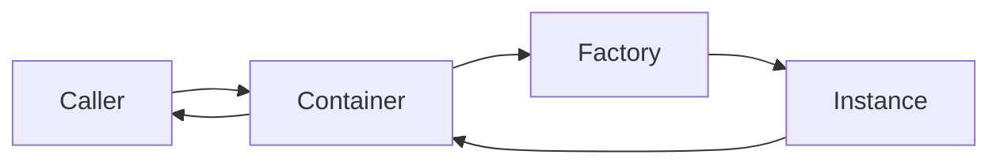

### Providers

`providers.ts` contains a dependency injection container that resolves services
as lazy singletons. It keeps the wiring of collaborators out of domain and
application code so that a context can change implementations without modifying
its use cases.

#### Types

Two internal types describe the container's records.

`ContainerEntry` tracks the factory and the resolved instance for a token:

```ts title="shared/application/providers.ts"
type ContainerEntry<T = unknown> = {
    instance: T | null
    factory: (r: Resolver) => T
}
```

`Registration` is the shape accepted by `register`. It carries only the factory,
since the instance starts as `null` and is filled on the first resolve:

```ts title="shared/application/providers.ts"
type Registration<T> = {
    factory: (resolver: Resolver) => T
}
```

#### Container

`Container` is the public class. It stores entries in a `Map` keyed by string
tokens and resolves each entry once, caching the result for subsequent calls.

```ts title="shared/application/providers.ts"
export class Container {
    register(entries: Record<string, Registration<unknown>>): this
    resolve<T>(token: string): T
    has(token: string): boolean
    unregister(token: string): boolean
    clear(): void
}
```

| Method | Description |
| --- | --- |
| `register(entries)` | Registers one or more tokens. Throws if a token is already present. Returns `this` for chaining. |
| `resolve<T>(token)` | Returns the singleton instance for the token, creating it on the first call. Throws if the token is not registered. |
| `has(token)` | Returns `true` if the token is registered. |
| `unregister(token)` | Removes the token and its cached instance. Returns `true` if it existed. Does not invalidate dependents already resolved. |
| `clear()` | Removes all registrations and cached instances. |

#### Circular dependency detection

The container tracks in-progress resolutions during each `resolve` call. If a
factory requests a token that is already being resolved in the same call chain,
a `CircularDependencyError` is thrown before any infinite loop can occur.

```ts
container.register({
    ServiceA: { factory: (r) => new ServiceA(r.resolve<ServiceB>('ServiceB')) },
    ServiceB: { factory: (r) => new ServiceB(r.resolve<ServiceA>('ServiceA')) },
})

container.resolve<ServiceA>('ServiceA')
// throws: Circular dependency detected for ServiceA
```

#### Usage

Register all tokens at once by passing a record to `register`. Each key is the
unique string identifier for that service. Factories receive the resolver so
they can declare their own dependencies.

```ts title="enrollment/main.ts"
import { Container } from '../shared/application/providers.ts'
import { InMemoryDatabaseDriver } from './application/database.ts'
import { InMemoryDatabaseManager } from './application/managers.ts'
import { CoursesRepository, StudentsRepository } from './application/repositories.ts'
import { CoursesService, StudentsService } from './application/services.ts'

const container = new Container()

container.register({
    DatabaseDriver: { factory: () => new InMemoryDatabaseDriver({}) },
    DatabaseManager: {
        factory: (r) => r.resolve<InMemoryDatabaseDriver>('DatabaseDriver').connect('default'),
    },
    CoursesRepository: {
        factory: (r) => new CoursesRepository(r.resolve<InMemoryDatabaseManager>('DatabaseManager')),
    },
    StudentsRepository: {
        factory: (r) => new StudentsRepository(r.resolve<InMemoryDatabaseManager>('DatabaseManager')),
    },
    CoursesService: {
        factory: (r) => new CoursesService(
            r.resolve<InMemoryDatabaseManager>('DatabaseManager'),
            r.resolve<CoursesRepository>('CoursesRepository'),
        ),
    },
    StudentsService: {
        factory: (r) => new StudentsService(
            r.resolve<InMemoryDatabaseManager>('DatabaseManager'),
            r.resolve<StudentsRepository>('StudentsRepository'),
        ),
    },
})

const coursesService = container.resolve<CoursesService>('CoursesService')
const studentsService = container.resolve<StudentsService>('StudentsService')
```

Because `DatabaseManager` is a singleton, `CoursesRepository` and
`StudentsRepository` share the same manager instance even though each factory
calls `r.resolve('DatabaseManager')` independently.

> **Warning**
> `unregister` removes the token and its cached instance but does not
> invalidate other tokens whose cached instances already hold a reference to
> the removed service. Re-register and re-resolve dependents explicitly when
> that situation matters.

#### Example Flow



The caller invokes `resolve`. The container runs the factory only on the first
call and returns the cached instance on every subsequent one.
