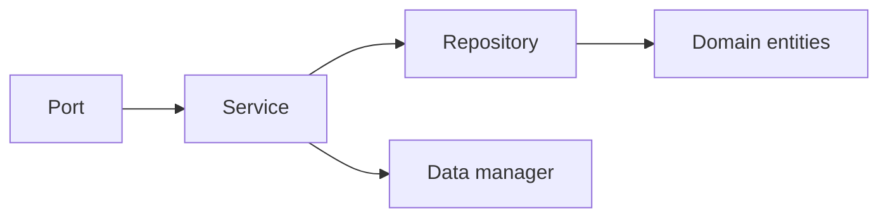

### Services

An application service is responsible for coordinating domain capabilities and
collaborators to fulfill a system purpose. It defines the process of a use
case, not the business meaning of the domain objects involved in that use case.

The generated template provides `Service` as a semantic base class for these
processes.

#### Base Class

`Service` is an abstract class with no concrete behavior.

```ts title="shared/application/services.ts"
export abstract class Service {
    [property: string]: unknown
}
```

This design is intentional. The generated class marks the role of the object
without imposing a method name, result shape, or framework-specific lifecycle.

#### Usage

In the following example we build services for a course enrollment system.
Each context provides its own service that receives its dependencies through
the constructor and exposes operations that the context ports can call.

```ts title="students/application/services.ts"
import { Service } from '../../shared/application/services.ts'
import { InMemoryDatabaseManager } from '../../shared/adapters/managers.ts'
import { StudentsRepository } from './repositories.ts'
import type { Student } from '../domain/students.ts'

export class StudentsService extends Service {
    [property: string]: unknown

    protected readonly manager: InMemoryDatabaseManager
    protected readonly repository: StudentsRepository

    public constructor(manager: InMemoryDatabaseManager, repository: StudentsRepository) {
        super()

        this.manager = manager
        this.repository = repository
    }

    public all() {
        return this.manager.all()
    }

    public create(student: Student) {
        return this.repository.create(student)
    }

    public delete(student: Student) {
        return this.repository.delete(student)
    }
}
```

```ts title="courses/application/services.ts"
import { Service } from '../../shared/application/services.ts'
import { InMemoryDatabaseManager } from '../../shared/adapters/managers.ts'
import { CoursesRepository } from './repositories.ts'
import type { Course } from '../domain/courses.ts'

export class CoursesService extends Service {
    [property: string]: unknown

    protected readonly manager: InMemoryDatabaseManager
    protected readonly repository: CoursesRepository

    public constructor(manager: InMemoryDatabaseManager, repository: CoursesRepository) {
        super()

        this.manager = manager
        this.repository = repository
    }

    public all() {
        return this.manager.all()
    }

    public create(course: Course) {
        return this.repository.create(course)
    }

    public delete(course: Course) {
        return this.repository.delete(course)
    }
}
```

```ts title="enrollment/application/services.ts"
import { Service } from '../../shared/application/services.ts'
import { InMemoryDatabaseManager } from '../../shared/adapters/managers.ts'
import { InscriptionsRepository } from './repositories.ts'
import type { Inscription } from '../domain/inscriptions.ts'

export class InscriptionsService extends Service {
    [property: string]: unknown

    protected readonly manager: InMemoryDatabaseManager
    protected readonly repository: InscriptionsRepository

    public constructor(manager: InMemoryDatabaseManager, repository: InscriptionsRepository) {
        super()

        this.manager = manager
        this.repository = repository
    }

    public all() {
        return this.manager.all()
    }

    public create(inscription: Inscription) {
        return this.repository.create(inscription)
    }

    public delete(inscription: Inscription) {
        return this.repository.delete(inscription)
    }
}
```

Each service holds a reference to its manager and repository. The manager
provides raw list access; the repository delegates creation and deletion
through the domain entities.

> **Warning**
> `Service` does not guarantee a method name or a result contract. If the
> codebase needs those conventions, establish them explicitly in project code
> instead of assuming the generated base class already provides them.

#### Example Flow



This flow keeps orchestration in the application layer and domain meaning in
the domain layer.
